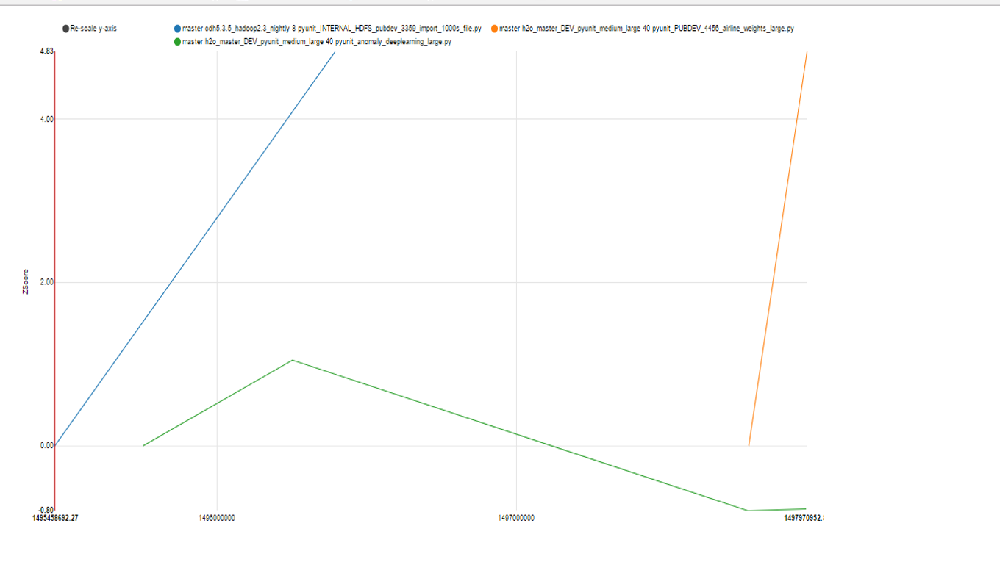
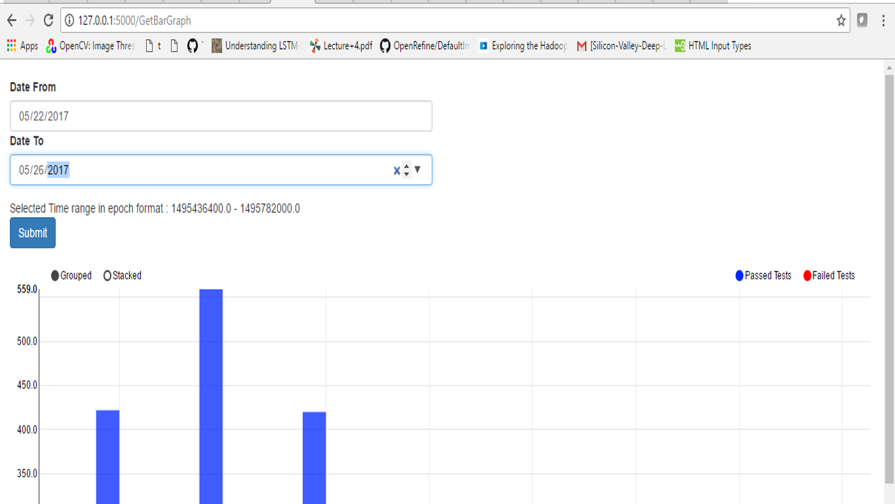
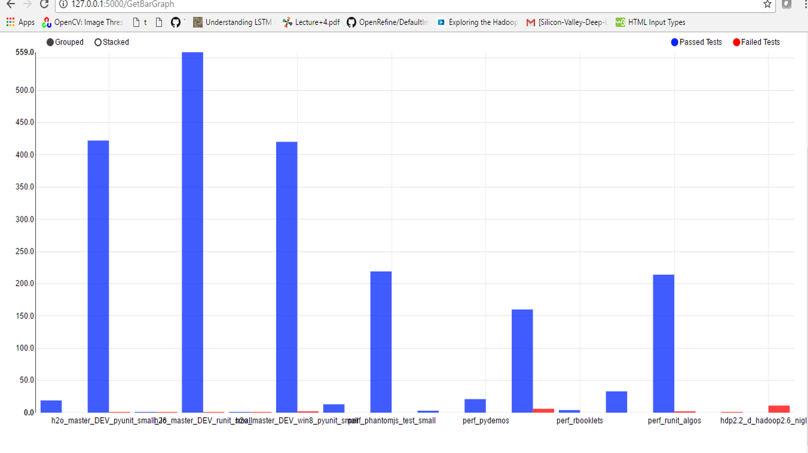

# Welcome to H2O MeetUp Hackathon!

## Assignment
Graphs developed : 

## index.html : Cumulative line graph
Description : For each test_name ncpu configuration date Vs normalized runtime is plotted

### What can we infer out of this? 

How is the runtime changing for the same test name and ncpu. 
If the runtime is dropping over time it could be a good starting point to optimize the test

Since the chart is plotted against various tests, we can compare different test runs on different dates. 

Since there are too many tests, I couldn't add a filter to select different ranges of test names, top 10, longest running tests etc. but 
we could add more filters to the graph to make it more managable and user friendly

## multiBarGraph.html : Multibar graph 
Description : This depicts the total number of passed and failed test runs grouped by each job
There are date filters added to reduce the cluttered test names on the graph. Due to time constraint, I could not clean up the graph properly

### What can we infer out of this? 

We can filter how many tests passed and failed.

I wrote a function called getRelevantFeatures() in top_jobs_ts.py
The idea was to pass the passed and failed jobs and it would return the column indices with highest score, supporting the output

We could use this feature selection (which fits multiple fits a number of randomized decision trees on subsets of data sample ) to see which columns are effecting the outcome and if this could be useful to do test optimizations

For eg. which columns are most related to output failed, we could may be then use these columns to see why the tests are failing

Initially this graph shows all the tests grouped by job name. We can then filter them down

## Test case for filtering mutiBarGraph

date from : 05-22-2017
date to : 05-26-2017

Returns reduced results

give a random date : It should return no data

## Technical details
 -- using numpy, sklearn, tzlocal for python and bootstrap and datepicker libraries for UI in addition to the packages used in the existing code
 -- All the changes made to the existing code, new functions are updated in the last commit
  
