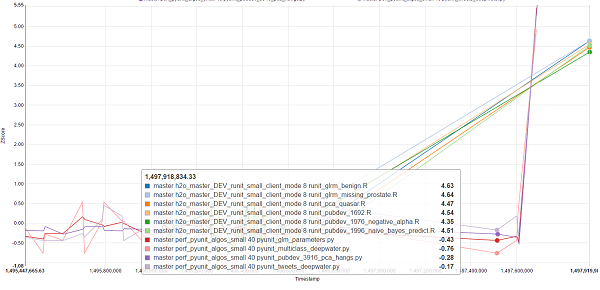

## Assignment: Dashboard
Build a dashboard with some interesting insight that you have discovered in our unit test data. This is an open ended test, come up with something original and show us your best work.



### Instructions
First fork this GitHub repo with your GitHub account.

The directory contains:
```
static/index.html
top_jobs_ts.py
test_30day.csv.gz
```
To run the example unzip the `test_30day.csv.gz` and run `python top_jobs_ts.py`
These files should help you get started. You can improve on the existing Python/Javascript code or start from scratch if you like.
The main objective is to build an end to end data product that can be displayed in the web browser.  You can use any plotting library you like but extra bonus points for using Javascript / D3.js
